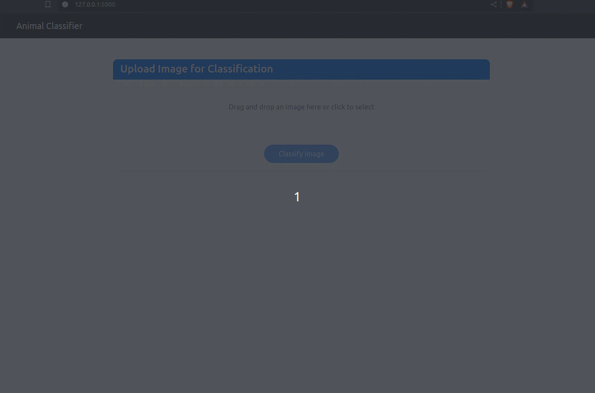

# 🏆 Animal Classifier Web Application

A web-based application for classifying images of animals using deep learning. The application can classify images into five categories: dog, cow, cat, lamb, and zebra.

**Project Group No.:** 1  
**Group Members:**

- **Fahim Muntashir** (2021183642)
- **Md Abul Bashar Nirob** (2022198042)
- **Tausib Abrar** (2121446642)
- **Muhammad Omar Mahin Jinnat** (2012826642)

## 📌 Project Overview 

This project consists of two main components:

1. A deep learning model trained to classify animal images
2. A web application that provides a user-friendly interface for image classification

### Features

- 🖼️ Drag-and-drop image upload
- 📱 Responsive design for all devices
- ⚡ Real-time image classification
- 📊 Confidence score display
- 🎨 Modern and intuitive UI
- 🔄 Support for multiple image formats (PNG, JPG, JPEG, GIF)

## 🎥 Demo



_Watch how the Animal Classifier works in action!_

## 🚀 Running the Project

### Local Setup

Follow the installation steps below to run the project locally.

### Cloud Platforms

The project can also be run on cloud platforms:

#### Google Colab

- Access free GPU resources
- Run the web application using ngrok
- See [colab_kaggle_setup.md](colab_kaggle_setup.md) for detailed instructions

#### Kaggle

- Use Kaggle's GPU resources
- Deploy the web application
- See [colab_kaggle_setup.md](colab_kaggle_setup.md) for detailed instructions

## ��️ Technical Stack

### Backend

- **Python 3.x**
- **Flask** - Web framework
- **TensorFlow/Keras** - Deep learning framework
- **Pillow** - Image processing

### Frontend

- **HTML5**
- **CSS3** with custom styling
- **JavaScript** (Vanilla)
- **Bootstrap 5** - UI framework
- **Font Awesome** - Icons

## 📂 Project Structure

```
animal-classifier/
├── static/
│   ├── css/
│   │   └── style.css
│   ├── js/
│   │   └── main.js
│   └── uploads/
├── templates/
│   └── index.html
├── images/
│   ├── cat/
│   ├── cow/
│   ├── dog/
│   ├── lamb/
│   └── zebra/
├── app.py
├── preprocess.py
├── train.py
├── predict.py
├── requirements.txt
└── README.md
```

## 🚀 How to Run the Project

### Prerequisites

- Python 3.x
- pip (Python package manager)
- Virtual environment (recommended)

### Installation Steps

1. **Clone the repository**

```bash
git clone https://github.com/FahimMuntashir/animal-classifier.git
cd animal-classifier
```

2. **Create and activate virtual environment**

```bash
# On Windows
python -m venv venv
venv\Scripts\activate

# On macOS/Linux
python -m venv venv
source venv/bin/activate
```

3. **Install dependencies**

```bash
pip install -r requirements.txt
```

4. **Train the model** (if not already trained)

```bash
python train.py
```

5. **Run the web application**

```bash
python app.py
```

6. **Access the application**

- Open your web browser
- Go to `http://localhost:5000`

## 💻 Using the Application

1. **Upload an Image**

   - Drag and drop an image into the upload zone
   - Or click the upload zone to select an image

2. **Classify the Image**

   - Click the "Classify Image" button
   - Wait for the prediction to be processed

3. **View Results**
   - The predicted animal class will be displayed
   - The confidence score will be shown
   - You can upload another image to try again

## 🎯 Model Performance

- **Accuracy Target:** 90%+
- **Classes Supported:** 5 (dog, cow, cat, lamb, zebra)
- **Model Architecture:** MobileNetV2 (Transfer Learning)
- **Training Data:** 100 images per class (500 total)

## 🔧 Development

### Adding New Features

1. Fork the repository
2. Create a new branch
3. Make your changes
4. Submit a pull request

### Customizing the UI

- Modify `static/css/style.css` for styling changes
- Edit `templates/index.html` for layout changes
- Update `static/js/main.js` for functionality changes

## 📝 License

This project is licensed under the MIT License - see the LICENSE file for details.

## 🤝 Contributing

Contributions are welcome! Please feel free to submit a Pull Request.

## 📞 Support

For support, please open an issue in the GitHub repository or contact the project maintainers.

----

Made with ❤️ by Group 1
